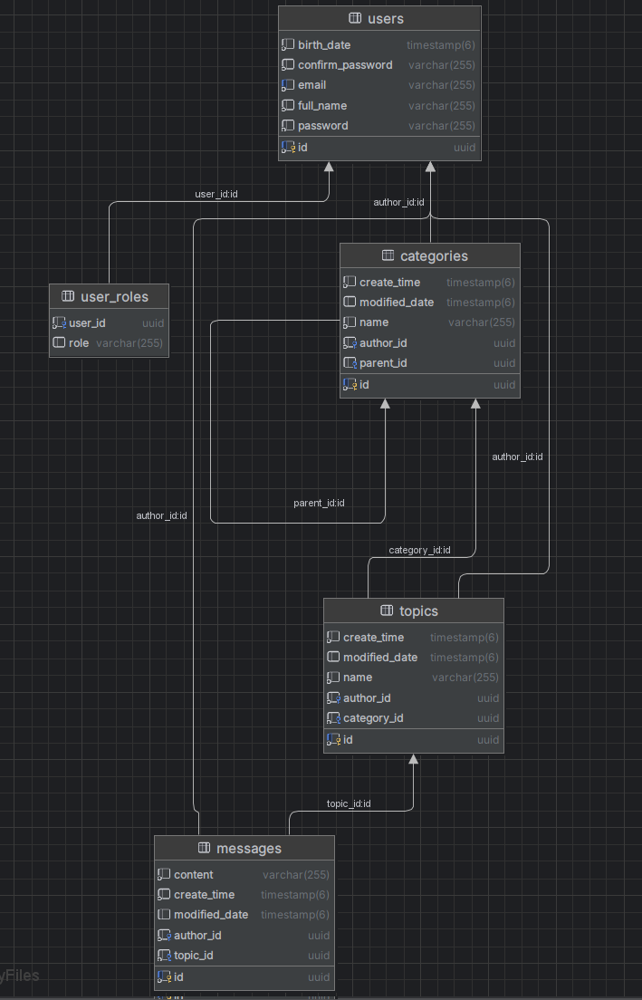
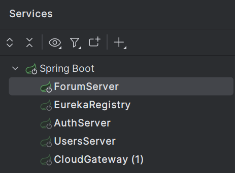

# Forum

Проект представляет собой API для пользовательского взаимодействия в рамках системы форума.

# Architecture
Основные микросервисы:
1. FORUM-APP: сервис ядра форума (обеспечивает работу с категориями, темами, сообщениями)
2. AUTH-APP: сервис, отвечающий за аутентификацию пользователей
3. GATEWAY: шлюз API

# Role-specific

На данный момент система не реализует разграничение привелегий.

Доступна роль пользователя

# Database-architecture
На данный момент используется общая БД:
## Class Diagram

# Configuration/Installation

Необходимо запустить в сервисы в следующем порядке:
1. Eureka Registry
2. ForumServer
3. AuthServer
4. UsersServer
5. CloudGateway (1)

# API Documentation

Для проекта настроен Swagger:
http://localhost:8989/webjars/swagger-ui/index.html