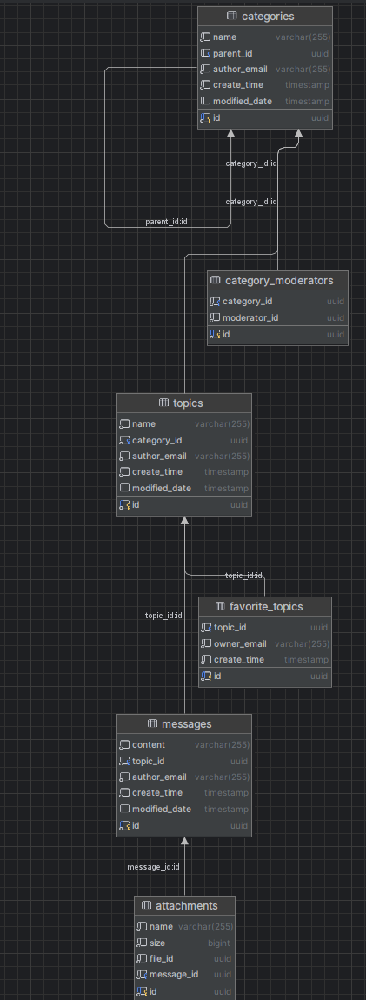

# Forum

Проект представляет собой API для пользовательского взаимодействия в рамках системы форума.

# Architecture
Основные микросервисы:
1. FORUM-APP: сервис ядра форума (обеспечивает работу с категориями, темами, сообщениями)
2. AUTH-APP: сервис, отвечающий за аутентификацию пользователей
3. GATEWAY: шлюз API
4. USERS-APP: сервис, отвечающий за управление пользователями со стороны Администратора
5. FILES-APP: сервис, отвечающий за загрузку и скачивание файлов
6. EUREKA-REGISTRY-APP: сервер, регистрирующий остальные микросервисы в Eureka

# Role-specific

Доступны роли пользователя, модератора, администратора.
Модератор обладает привелегиями в рамках категории и её дочерних - подкатегорий; 
соответственно - обладает привелегиями над топиками в категориях нижнего уровня

# Database-architecture
На данный момент используются различные Базы Данных под сервисы:

## Files Database

## Forum Database

## Users Database

# Configuration/Installation

Необходимо запустить сервисы в следующем порядке:
1. Eureka Registry
2. ForumServer
3. AuthServer
4. UsersServer
5. FileServer
6. Cloud Gateway (1)

# Environments

Необходимо в корне проекта создать .env файл, где будут содержаться переменные окружения.

И указать следующие переменные:
- HOST: хост приложения
- POSTGRES_USERNAME: имя пользователя для подключения к БД Postgres
- POSTGRES_PASSWORD: пароль для подключения к БД Postgres
- POSTGRES_DATABASE: имя базы данных, используемой в приложении
- JWT_SECRET: секретный ключ для подписи JWT (можно сгенерировать на https://www.base64encode.net/)
- JWT_ACCESS: время жизни access-токена в миллисекундах
- JWT_REFRESH: время жизни refresh-токена в миллисекундах
- API_SECRET: межсервисный API-ключ (также можно сгенерировать на https://www.base64encode.net/)

# API Documentation

Для проекта настроен Swagger:
http://localhost:8989/webjars/swagger-ui/index.html

Для переключения между сервисами необходимо выбрать опцию в поле "Select a definition"

(Эндпоинты с пагинацией имеют поле sort, которое может принимать поле и вид сортировки в таком виде):
sort: [
"createTime,desc"
]